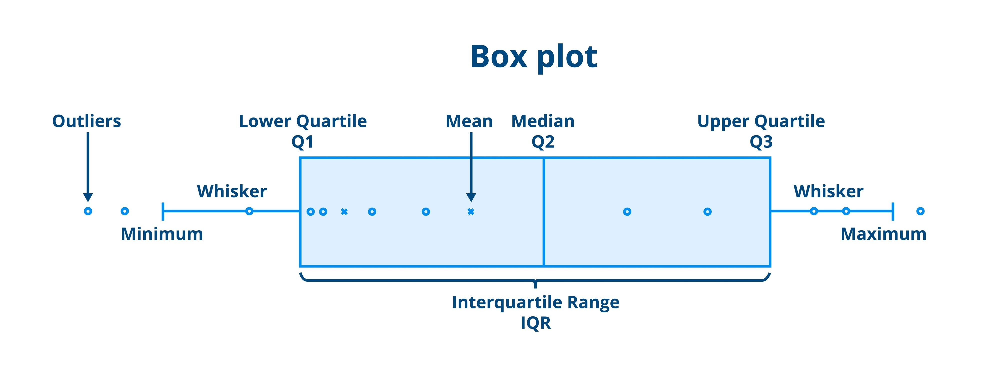
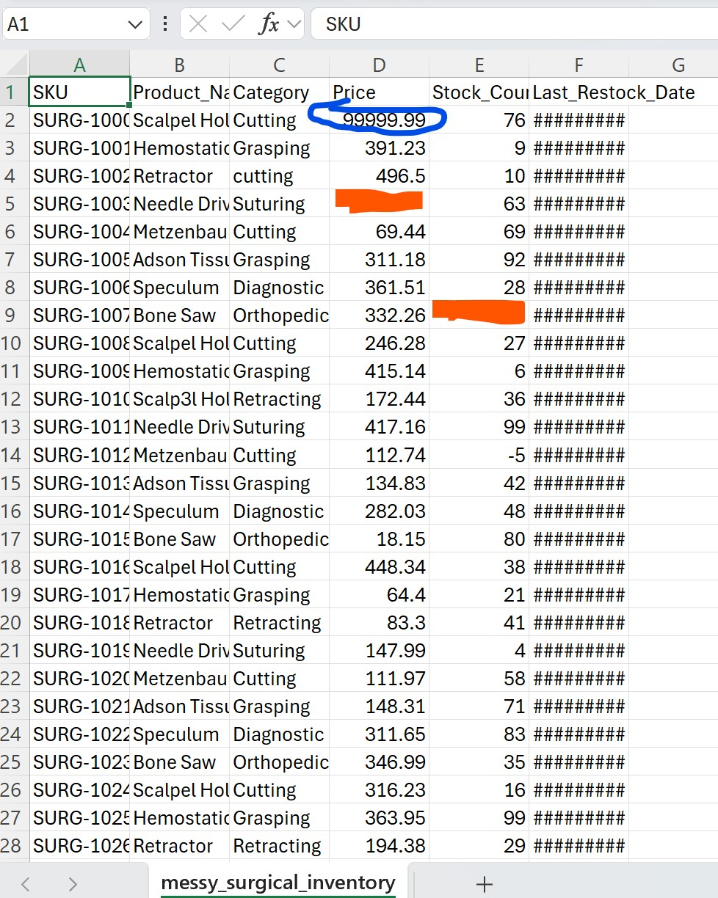
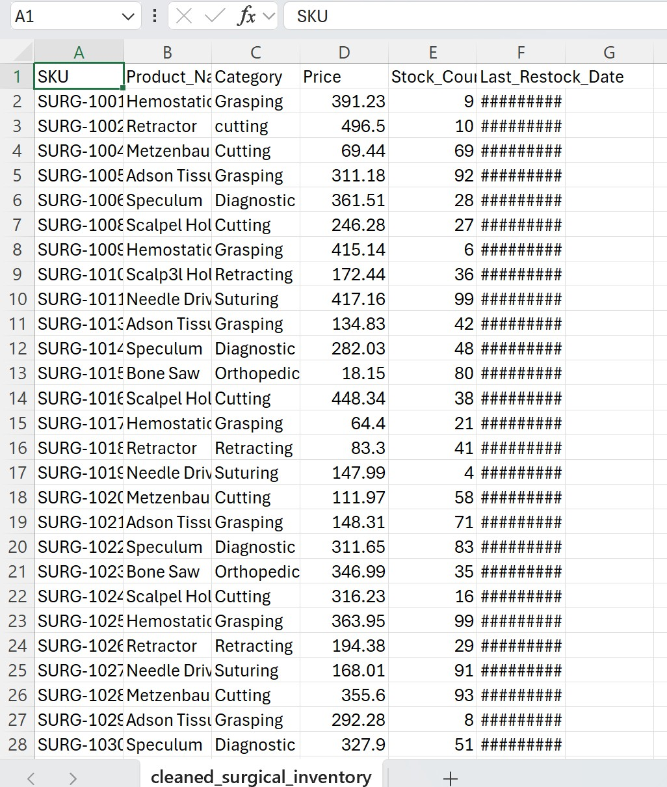
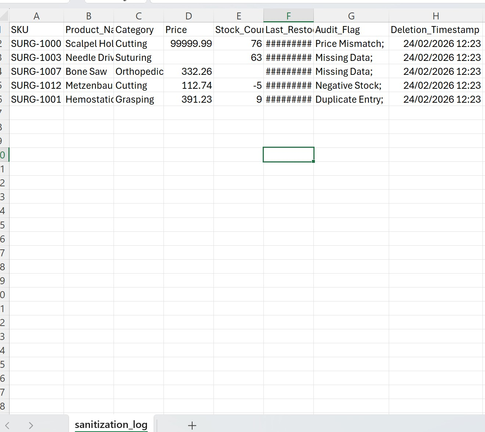
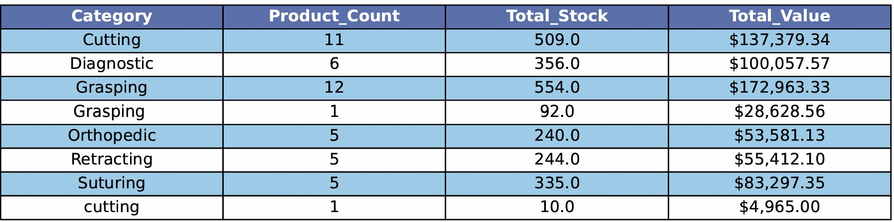
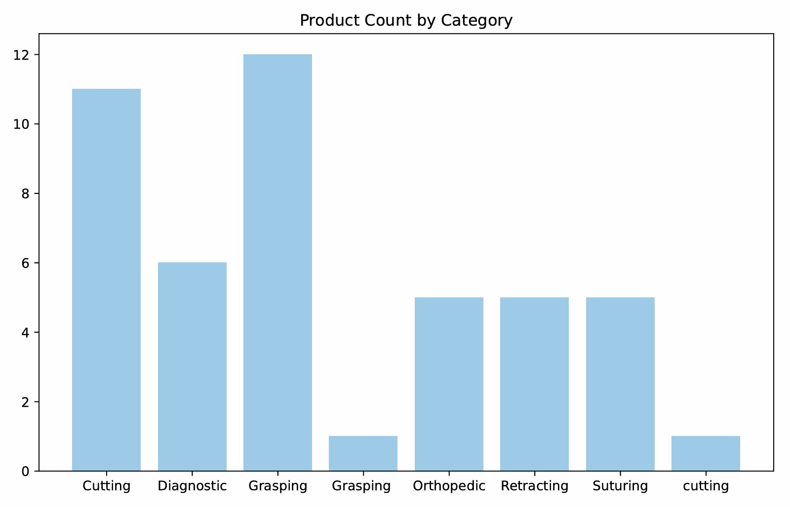
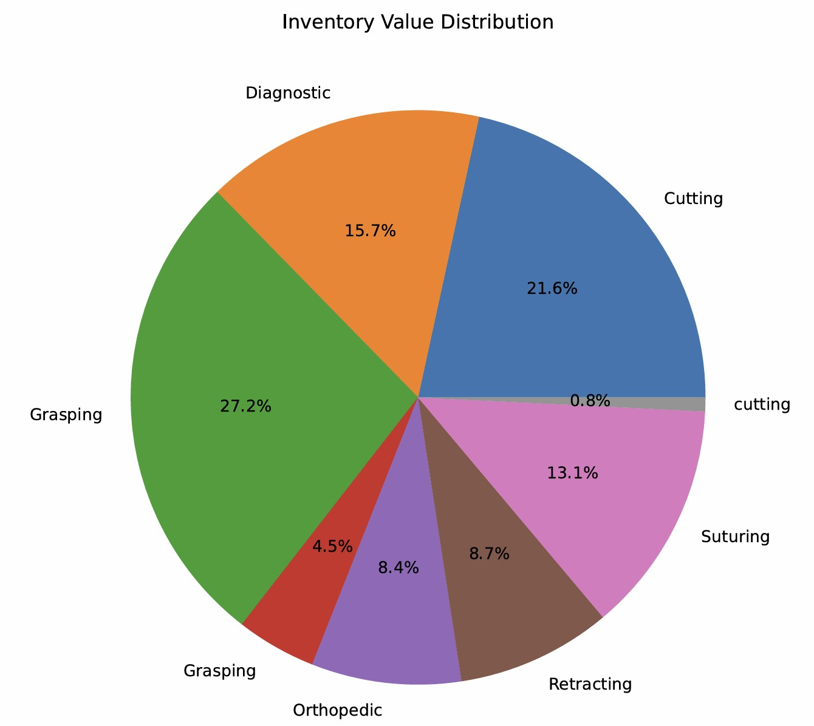
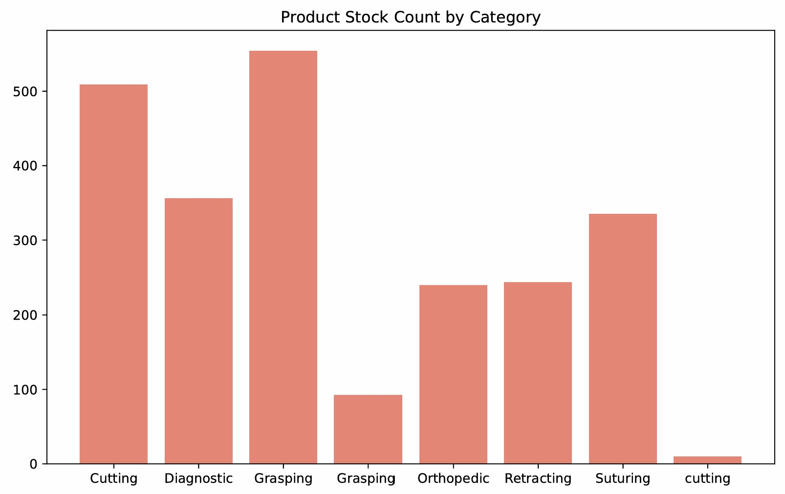

**Surgical Inventory Data Sanitizer**
---

This project provides a robust Python-based pipeline for small businesses to clean, audit, and analyze messy inventory data. It moves beyond basic scripts by implementing statistical outlier detection and an interactive human-in-the-loop review process.

## Key Features

Automated Auditing: Scans for duplicates, missing values, and logical inconsistencies.

Statistical Outlier Detection: Uses the Interquartile Range (IQR) method to identify suspicious pricing dynamically.

Interactive Review: A CLI-based "Wizard" that allows users to approve or reject proposed data deletions row-by-row.

Audit Trail: Every deletion is recorded in a sanitization_log.csv with a reason and a timestamp.

Professional Reporting: Generates a multi-page PDF Business Report including:

Executive Summary Table.

Product Count by Category (Bar Chart).

Inventory Value Distribution (Pie Chart).

## Tech Stack

Language: Python 3.x

Data Manipulation: pandas, numpy

Visualization: matplotlib

File Formats: CSV (Data/Logs), PDF (Reports)

## The Science: Outlier Detection

Instead of hard-coding price limits, this tool adapts to your data using the IQR Rule:

Q1: 25th percentile of prices.

Q3: 75th percentile of prices.

IQR: $Q3 - Q1$.

Bounds: Any price outside $[Q1 - 1.5 \times IQR, Q3 + 1.5 \times IQR]$ is flagged for review.

This ensures that if a store sells both $10 scalpels and $5,000 lasers, the tool doesn't accidentally delete valid expensive stock.

---
## Installation & Usage

**Clone the repository:**

`git clone https://github.com/yourusername/surgical-sanitizer.git
cd surgical-sanitizer`

**Install dependencies:**

`pip install -r requirements.txt`

**Run the pipeline:**

`python main.py`

---
## Project Structure

├── data/
│   ├── messy_surgical_inventory.csv   # Raw input
│   ├── cleaned_surgical_inventory.csv # Final sanitized data
│   └── sanitization_log.csv           # Audit trail of deletions
│   └──Surgical_Inventory_Report.pdf   # Output business report
├── img/
│   ├── img.png                        # Image used in the README.md file
├── main.py                            # Project Orchestrator
├── sanitize_data.py                   # IQR Logic & Interactive CLI
├── generate_validation_report.py      # Auditing functions
├── create_sample_data.py              # Fake data generator

## Author

Sruthi | Data Science Enthusiast

## Contributing

Contributions are what make the open-source community such an amazing place to learn, inspire, and create.

1. **Fork** the Project.
2. Create your **Feature Branch** (`git checkout -b feature/AmazingFeature`).
3. **Commit** your Changes (`git commit -m 'Add some AmazingFeature'`).
4. **Push** to the Branch (`git push origin feature/AmazingFeature`).
5. Open a **Pull Request**.
---

## License

This project is licensed under the MIT License - see the [LICENSE](LICENSE) file for details.

> **Disclaimer**: This tool is for educational and administrative inventory management purposes only. It is not intended for clinical decision-making or real-time surgical scheduling.

## Messy input data

 

## Cleaned Data
 

## Audit Log

## Inventory Summary

